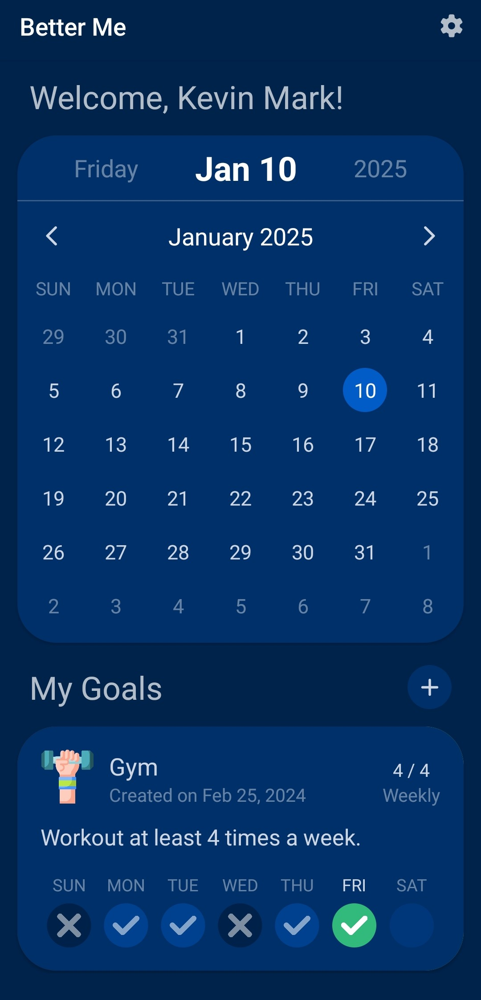
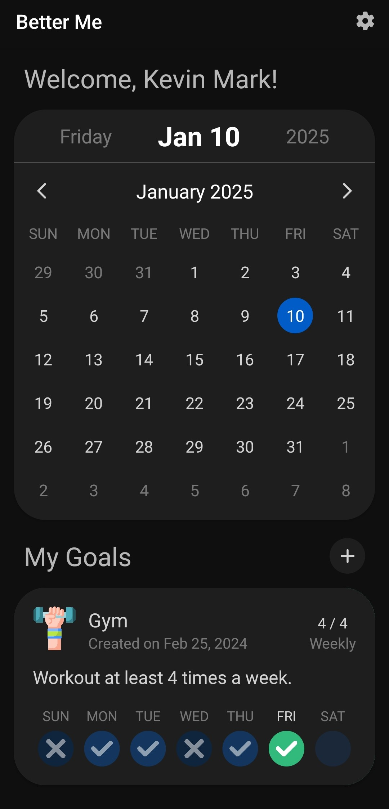
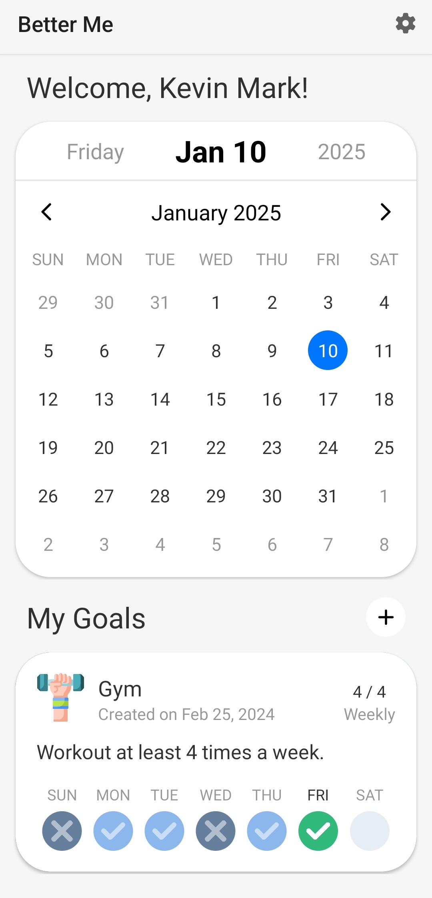
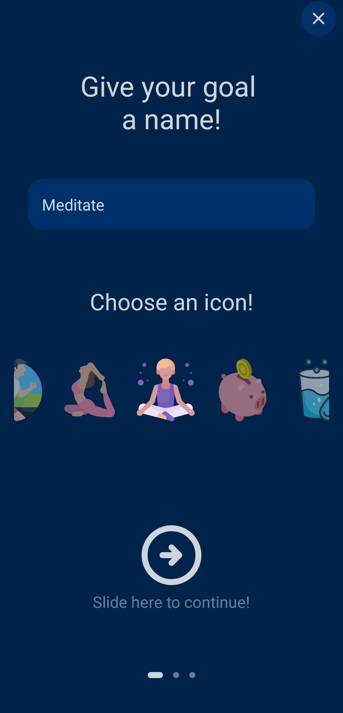
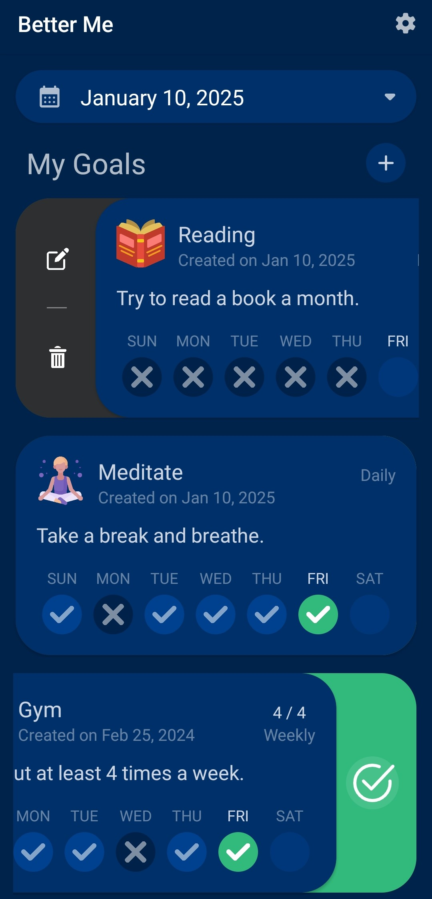
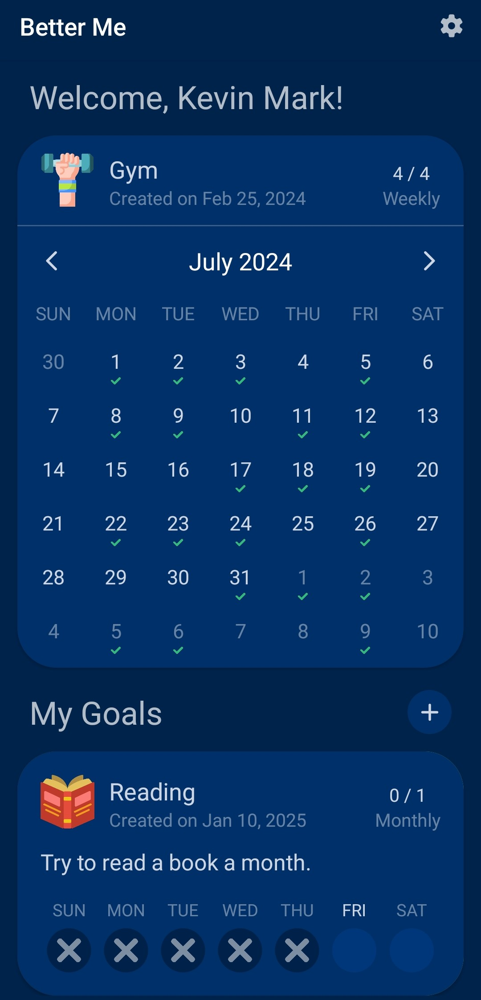
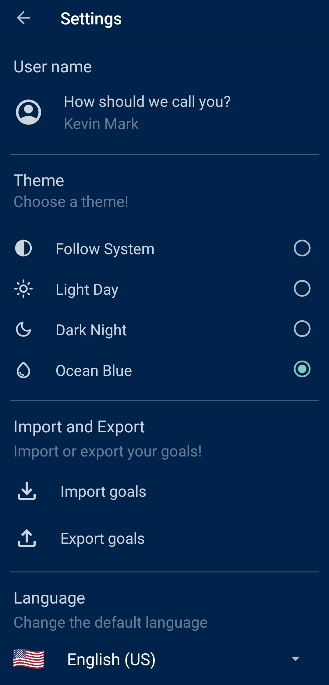

# Better Me - Goal Tracker App 📱🎯

A mobile application for **Android** built with **Java** in **Android Studio**, designed to help users track and achieve their goals. With customizable features and a sleek design, this app provides an interactive and intuitive way to stay on top of personal objectives.

  
  
  

## ✨ Key Features

  

  <h3>📝 <strong>Create and Manage Goals</strong></h3>
      <ul>
        <li>Add any goal with:
          <ul>
            <li><strong>Custom icon</strong> to represent the goal.</li>
            <li><strong>Description</strong> of the objective.</li>
            <li><strong>Frequency</strong> options:
              <ul>
                <li>Daily</li>
                <li>Weekly</li>
                <li>Monthly</li>
                <li>Yearly</li>
              </ul>
            </li>
            <li><strong>Target count</strong> for the selected frequency.</li>
          </ul>
        </li>
        <li>Goals are displayed on the main screen with:
          <ul>
            <li>Icon, title, description, frequency, and progress.</li>
            <li><strong>Progress Tracker</strong> showing completion relative to the frequency.</li>
          </ul>
        </li>
      </ul>
  

  

---

  
  

  <h3>🎯 <strong>Interactive Goal Cards</strong></h3>
      <ul>
        <li>Swipe <strong>right</strong> on a goal card to:
          <ul>
            <li><strong>Edit</strong> the goal.</li>
            <li><strong>Delete</strong> the goal.</li>
          </ul>
        </li>
        <li>Swipe <strong>left</strong> on a goal card to:
          <ul>
            <li>Mark a specific day as <strong>completed</strong>.</li>
          </ul>
        </li>
        <li>Long-press a goal card to:
          <ul>
            <li>Load its information into the <strong>custom calendar</strong> for  detailed exploration of completed dates.</li>
          </ul>
        </li>
      </ul>
  

---

  

  <h3>📆 <strong>Custom Calendar</strong></h3>
      
A fully custom-built calendar, optimized specifically for this application, offering:

      <ul>
        <li><strong>Goal-specific views</strong>: Displays the selected goal’s completed dates.</li>
        <li><strong>Expandable/Collapsible views</strong>: Switch between minimized and maximized views seamlessly.</li>
        <li><strong>Date editing</strong>: Mark past dates as completed or not completed.</li>
        <li><strong>Fluid animations</strong>: Enjoy smooth transitions and interactions, optimized for performance.</li>
      </ul>
      
This calendar stands out with its exceptional performance, surpassing many generic Android calendar libraries.

  

  

---

  
  

  <h3>⚙️ <strong>Settings Screen</strong></h3>
      
Personalize your experience with options such as:

      <ul>
        <li><strong>Username customization</strong>: Set a personalized name for the welcome message.</li>
        <li><strong>Theme selection</strong>: Choose from three themes:
          <ul>
            <li>Dark</li>
            <li>Light</li>
            <li>Blue</li>
          </ul>
        </li>
        <li><strong>Data management</strong>:
          <ul>
            <li>Import goals.</li>
            <li>Export goals to ensure data is never lost.</li>
          </ul>
        </li>
        <li><strong>Language preference</strong>: Switch between:
          <ul>
            <li>English</li>
            <li>Spanish</li>
          </ul>
        </li>
      </ul>
  

## 🚀 Highlights and Star Features
- **Interactive Goal Cards**: Swipe to edit, delete, or mark progress.
- **Custom Calendar**: A high-performance, multi-function calendar.
- **Fully customizable goal creation**: Tailor goals to your needs.
- **Three themes available**: Adapt the app to your style.

## 🛠️ Technologies Used
- **Java**: Core programming language.
- **Android Studio**: Development environment.
- **GSON**: Store goals in JSON files.
