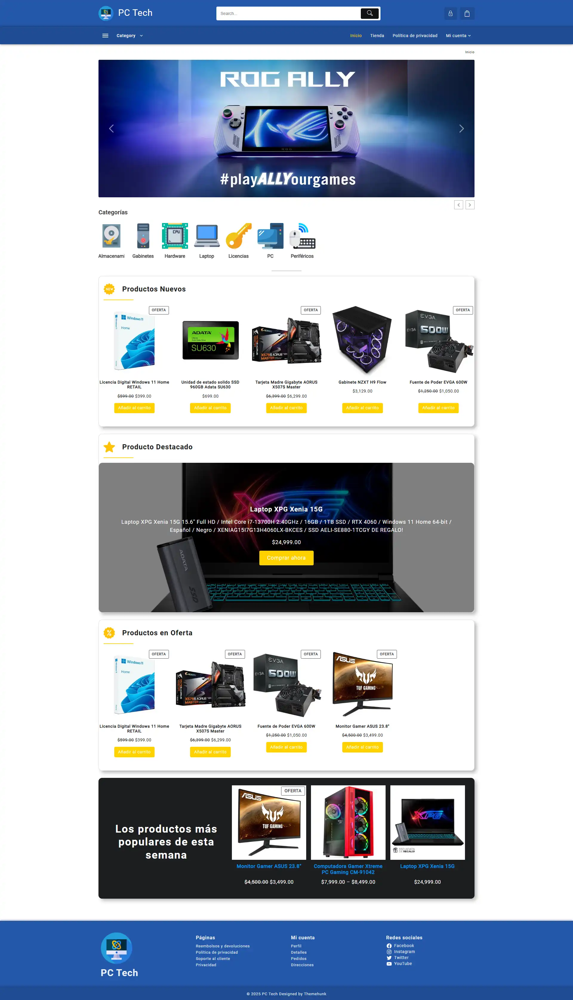
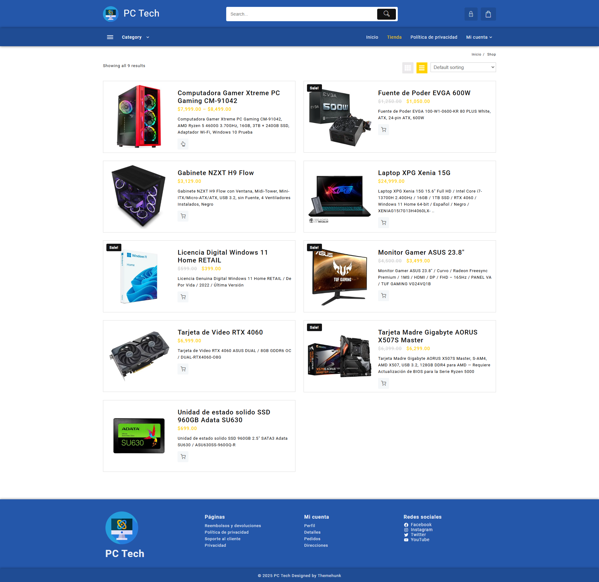
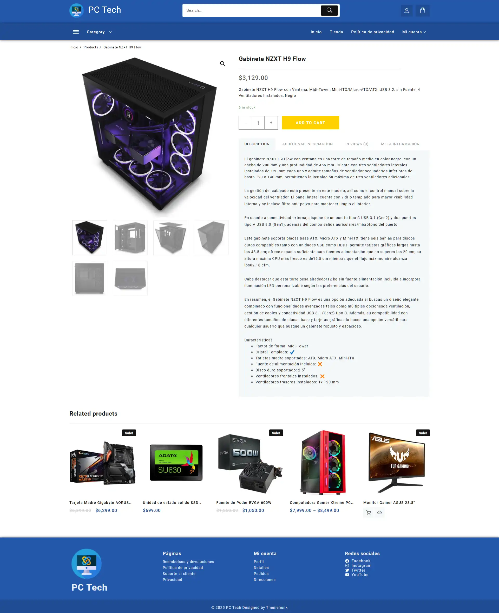
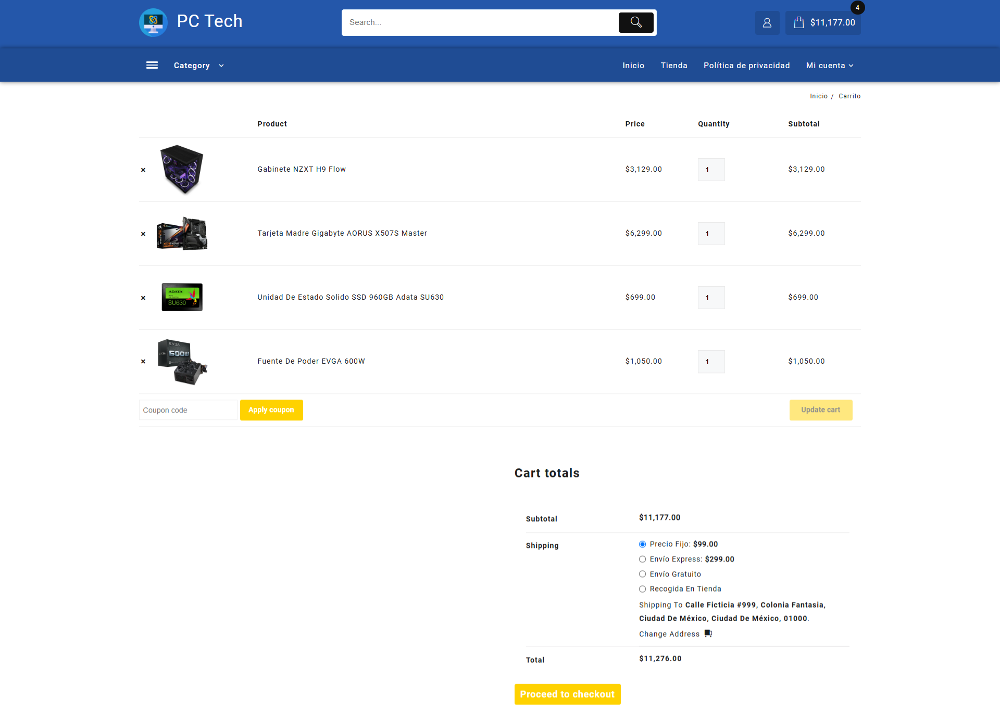
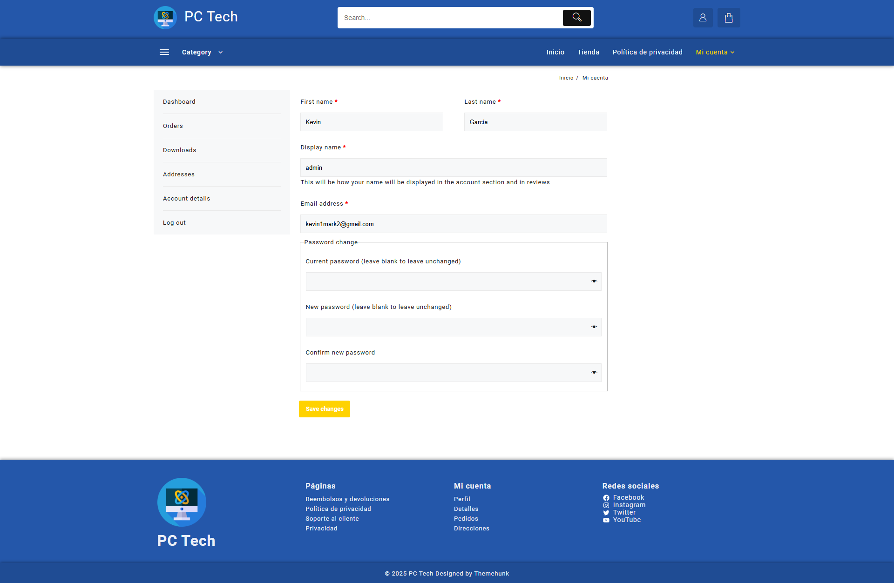
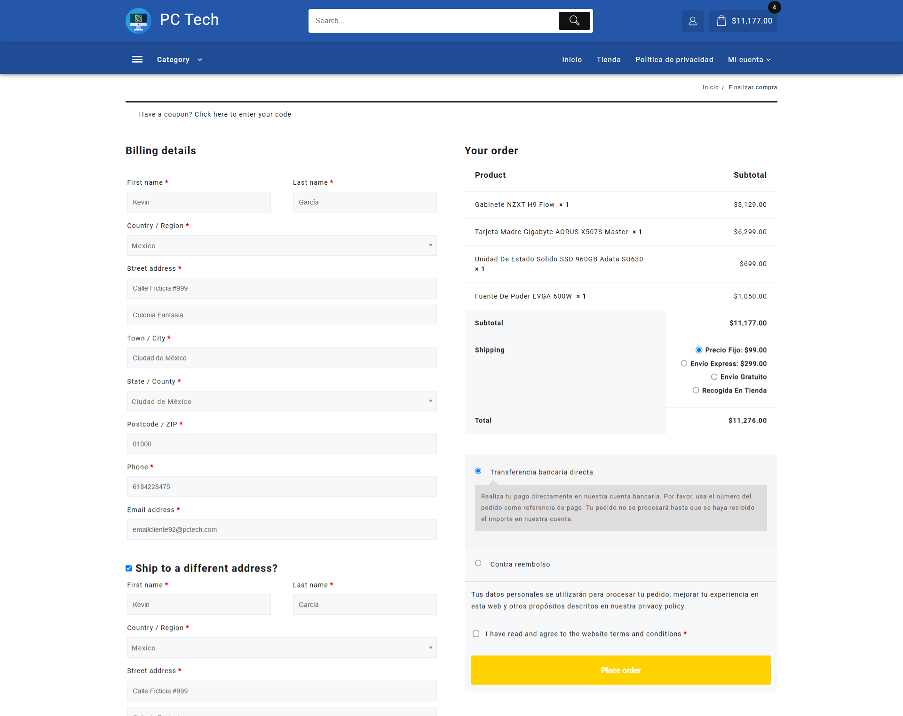

# PCTech Online Store 🖥️🛒

**PCTech** is an online store for PC hardware components and software licenses, built using **WordPress** and **WooCommerce**. Initially developed locally, the store is fully prepared for deployment in a real-world environment, offering a seamless shopping experience.

---

## ✨ Key Features

### 🏠 **Home Page**
- Highlights featured products and special offers.
- User-friendly design to capture visitor interest immediately.

---

### 🛍️ **Product Listings**
- Display products in **list** or **grid views**.
- **Filters** for sorting products by:
  - Name
  - Price
  - Popularity
  - Product categories
- Integrated **search bar** for quick access to desired items.

---

### 📄 **Product Detail Page**
- **Rich product information**:
  - Images and galleries.
  - Detailed descriptions and specifications.
  - Customer reviews and ratings.
  - Related products suggestions.
- **Purchase options**:
  - Variant selection.
  - Quantity adjustment.
  - Add-to-cart functionality.

### 🛒 **Shopping Cart**
- **Accessible anywhere**: 
  - Slide-in sidebar view available throughout the store for quick access.
  - Dedicated **Cart Page** for a more detailed view.
- **Cart Features**:
  - Lists all added products with their details.
  - Displays itemized costs and total sums.
  - Provides actions for:
    - Adjusting product quantities.
    - Removing products.
    - Proceeding to checkout with a single click.
- **User-friendly design**: Intuitive and responsive interface for a seamless shopping experience.

---

### 👤 **Account Information**
- Comprehensive account management system with sections for:
  - **Personal details**: Update profile information.
  - **Current and past orders**: Track orders easily.
  - **Digital downloads**: Access purchased software licenses.
  - **Shipping addresses**: Manage saved addresses.
  - **Password updates**: Ensure account security.

---

### 🛒 **Checkout Process**
- **Streamlined checkout experience**:
  - Shipping address and contact details.
  - Shipping cost calculations.
  - Payment options:
    - **PayPal**
    - **Credit/Debit cards (Visa, etc.)**
- **Real orders**: All purchases are processed and manageable through the **WooCommerce Admin Panel**.

---

### 📑 **Footer**
- Includes **quick links** to:
  - Essential store pages.
  - User account management sections.
  - Store’s social media profiles.

---

## 🛠️ Technologies Used
- **WordPress**: CMS for building the platform.
- **WooCommerce**: E-commerce plugin for managing the store.
- **Customizable themes**: Tailored design for a professional look.
- **Extensions and plugins**:
  - Payment gateways.
  - Review management.
  - SEO optimization tools.

---

## 🌟 Highlights
- Fully customizable product display (list and grid views).
- Enhanced filtering and search functionality.
- Secure and user-friendly checkout process.
- Complete account management system for customers.
- Ready for deployment in a production environment.