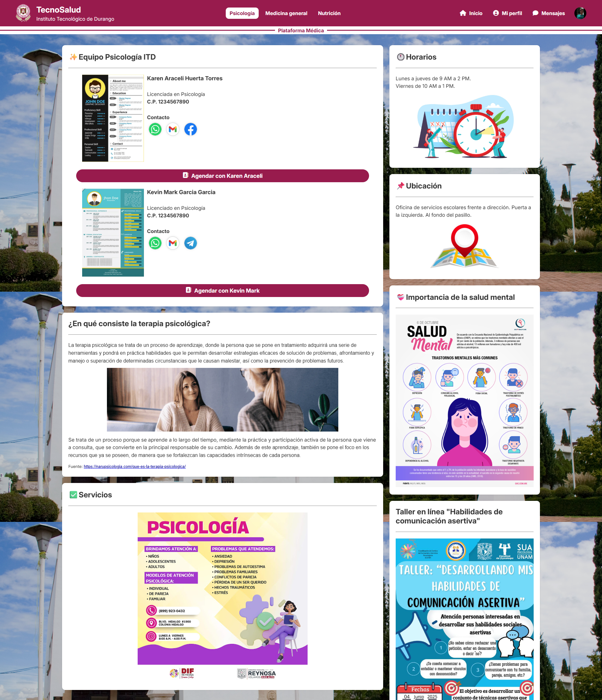
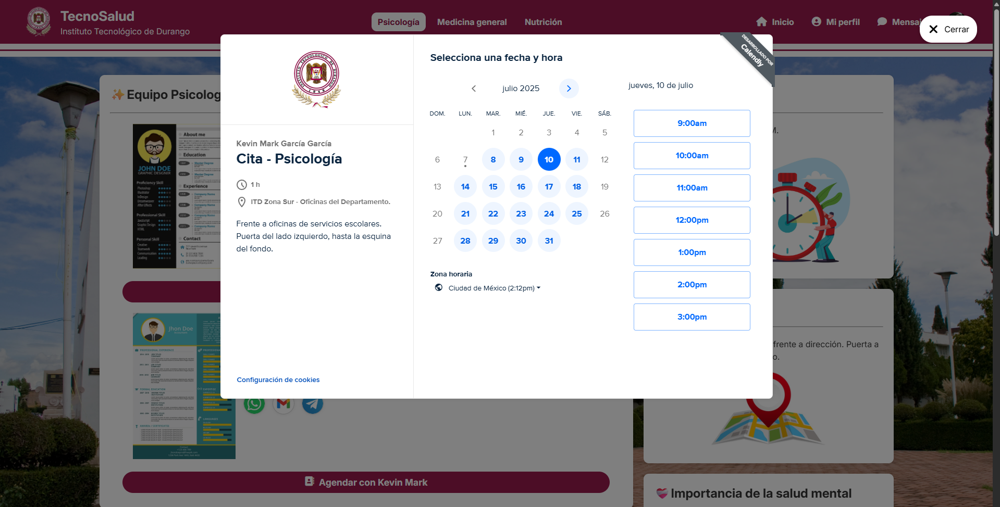
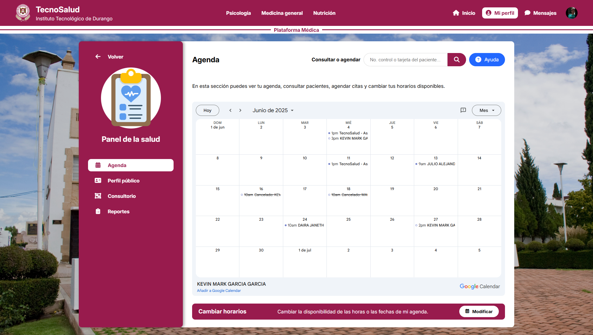
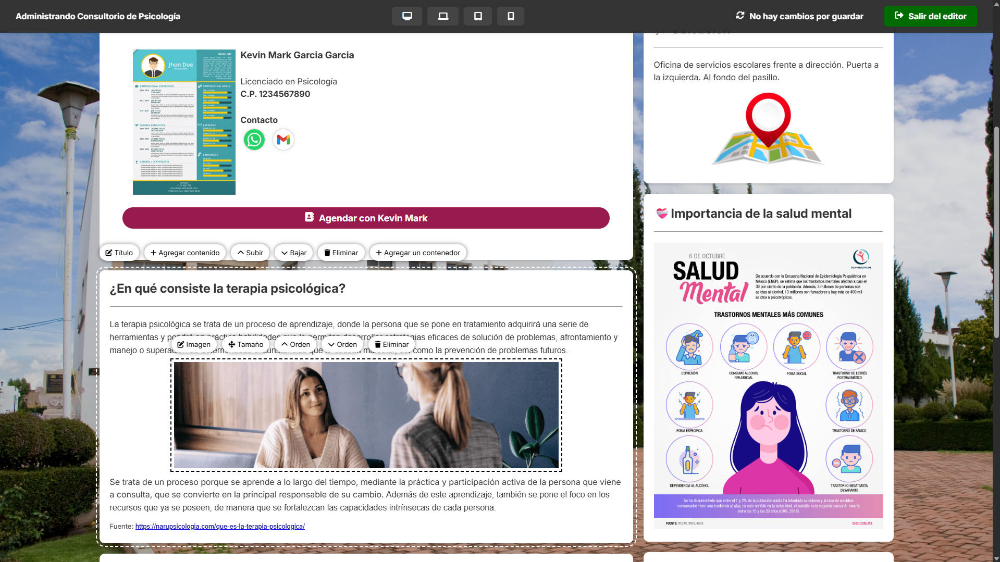
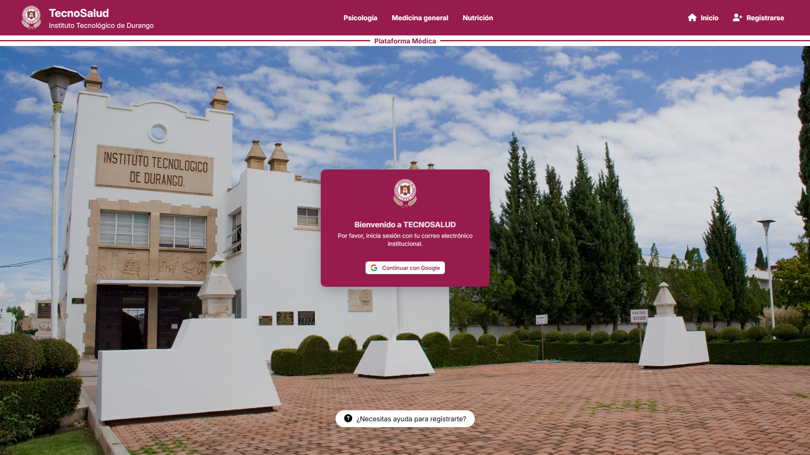
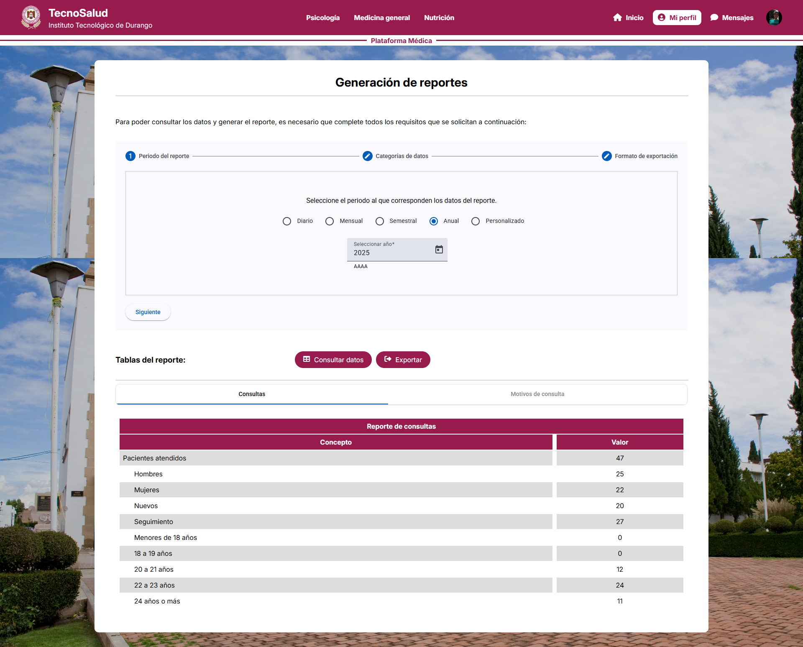
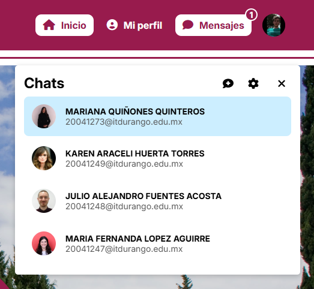
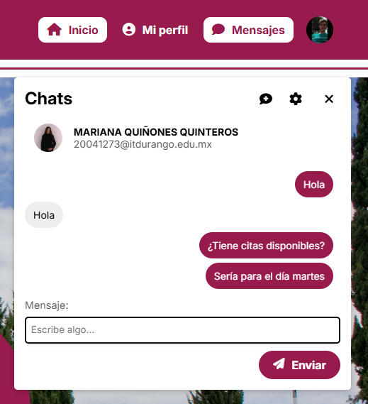

# TecnoSalud - University Health Platform 🌐💉💻

A full-stack responsive web platform built with **Angular**, **NestJS**, and **PostgreSQL** that connects students and university staff with healthcare professionals from the **Psychology**, **Nutrition**, and **General Medicine** departments, presenting a modern, smooth and user-friendly UI.

This is a **genuine project** that was executed as part of my professional responsibilities at the Instituto Tecnológico de Durango. It was carried out **in collaboration with the institute's health departments** and offers a solution to actual problems identified during an investigation and collection of **requirements**.

## ✨ Key Features

### 👩‍⚕️ **Health Departments in the Spotlight**
- Browse detailed profiles of healthcare professionals, including contact information.
- Access the agenda of the health professional of your choice and book an appointment.
- Access useful multimedia and resources related to each department, such as location, schedules, events and more.

### 💻 **Virtual Scheduling Made Simple**
- Patients can book their own appointments anytime using their phone or computer.
- Automatically sends invitation emails to participants with rescheduling and cancellation links.
- Seamlessly integrated with the **Calendly API** for smooth virtual agenda management.

### 📅 **Centralized Agenda Management**
- Healthcare professionals can view and manage schedules through a **Google Calendar** integration in **real time**.
- There are three types of **event views** available: monthly, weekly, and agenda.
- **Interactive events** with patient information and options to:
  - Reschedule.
  - Cancel appointments.

### ✅ **Dynamic Content**
- Healthcare staff can update wall content in real time using a custom-built **Content Management System (CMS)**.
- Easily manage displayed information through an intuitive and user-friendly interface.

<!--  -->

### 🔒 **Fast and Secure Authentication**
- User management with **Clerk** is possible **without** the use of **passwords**.
- Registration and log in of users belonging to the university through **Institutional Google Account**.
- Implementation of **JWT tokens**.

### 📊 **Time Saving Reports**
- Generate and export **customized** statistical **reports** on the activities of health departments and their patients with **just a few clicks**.
- Built with **Angular Material** components for a fast and intuitive experience.

### 🩺 **Centralized Patient Care**
- **Access** and **manage patient information**, including medical records and history.
- **Consult** patients directly **within the platform** for streamlined care.
- Improve coordination and decision-making through **centralized** data access.

### 💬 **Integrated Chat Communication**
- **Real-time messaging** between healthcare professionals and their patients.
- Features include **persistent conversations** and unread message indicators.
- Powered by **WebSockets** for fast and reliable communication.

## 🎯 Solving Real Problems
This platform addresses key challenges:
1. **Appointment Scheduling**: Automates the booking process for efficiency.
2. **Accessibility**: Provides easy access to healthcare services and information.
3. **Centralized Management**: Simplifies handling of schedules, reports, patient attention and records for healthcare professionals.
4. **Communication**: Allows users to easily access healthcare professionals' contact information. Additionally, it features a real-time chat feature that enables seamless communication.
5. **Valuable tools**: Equips healthcare professionals with various tools to enhance patient care, streamline processes, and optimize efficiency.

## 🛠️ Technologies Used
- **Angular**: Frontend framework.
- **NestJS**: Backend framework - API RESTful.
- **PostgreSQL**: Data storage service.
- **Clerk API**: User authentication and management.
- **Calendly API**: Virtual scheduling management.
- **Google Calendar API**: Calendar synchronization.
- **WebSockets**: Real-time chat features.