# University Health Platform 🌐💉💻

A web platform built with **React** and **Firebase** that connects students and university staff with healthcare professionals from the departments of **psychology**, **nutrition**, and **general medicine**. This platform simplifies scheduling virtual appointments, providing accessible healthcare services and useful information for patients.

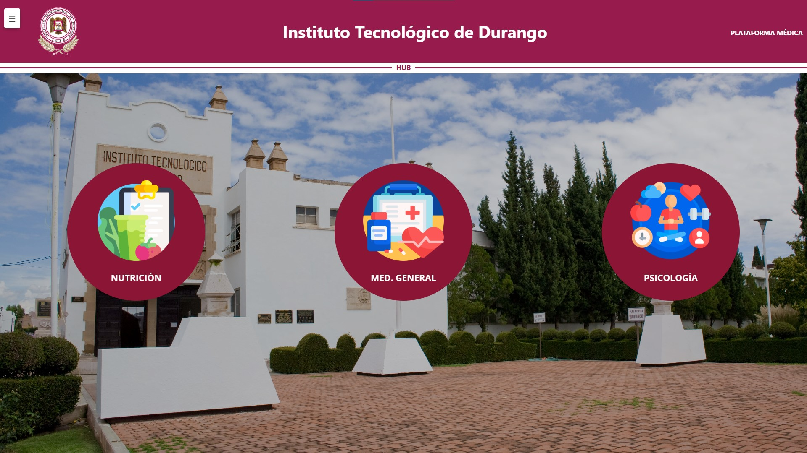

---

## ✨ Key Features

### 🗓️ **Virtual Scheduling Made Simple**
- Patients can schedule their own appointments anytime using their phone or computer.
- Automated scheduling system that streamlines the appointment process.
- Integrated with **Calendly API** for seamless management of virtual agendas.

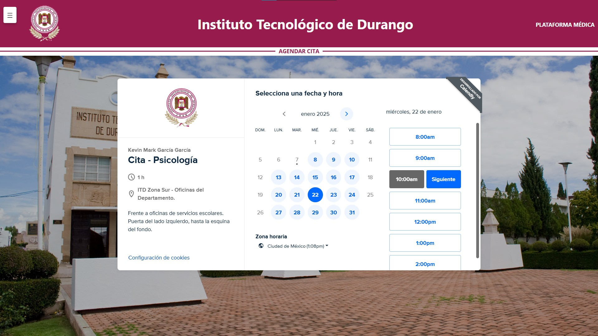

### 👩‍⚕️ **Doctor Profiles and Resources**
- Browse detailed profiles of healthcare professionals, including contact information.
- Access useful multimedia and resources related to each department:
  - **Psychology**: Mental health tips, session expectations, etc.
  - **Nutrition**: Healthy eating guides, recipes, etc.
  - **General Medicine**: Common illness prevention, FAQs, etc.
- Multimedia content is displayed interactively with **Lightbox for React**.

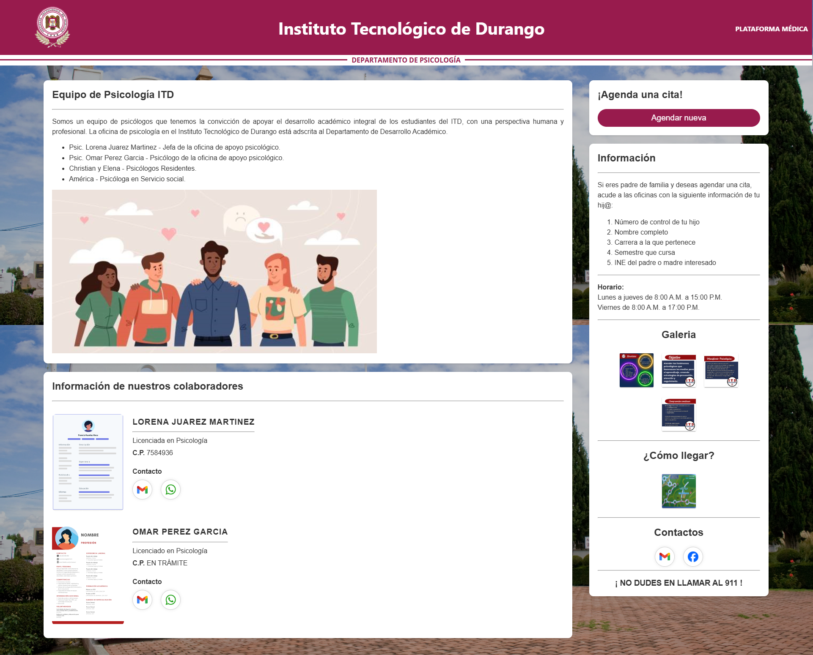
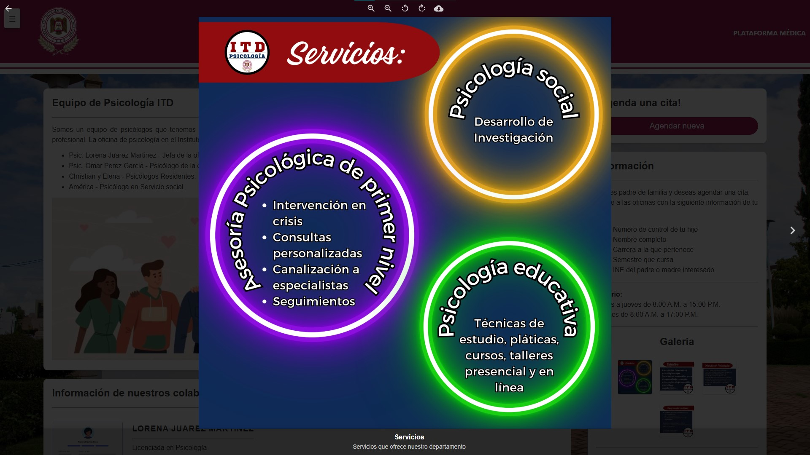

### 📅 **Centralized Agenda Management**
- Doctors can view and manage schedules through a **FullCalendar** integration.
- Real-time synchronization with **Google Calendar API**.
- Automatic email invitations for participants with options to:
  - Reschedule.
  - Cancel appointments.

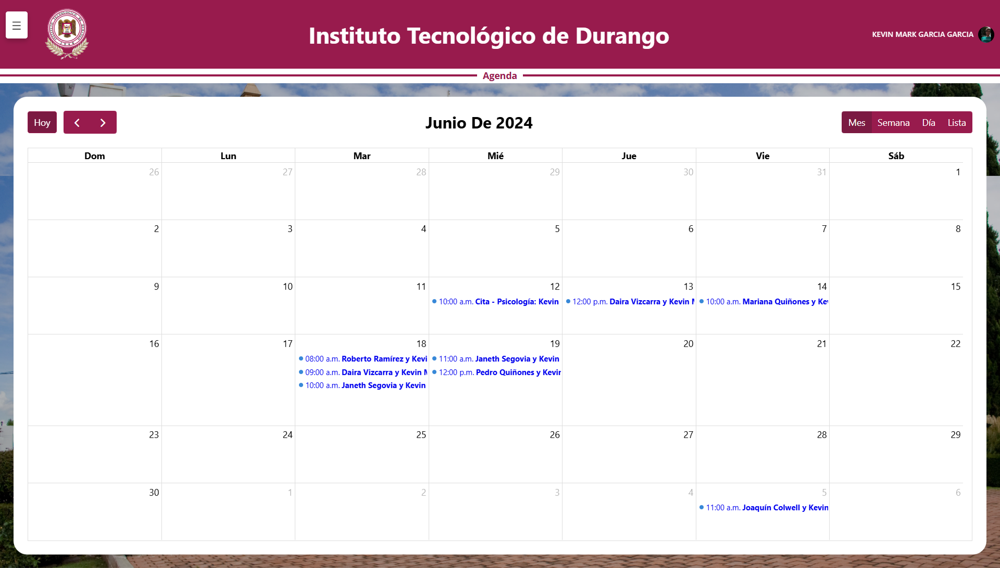

---

## 🎯 Solving Real Problems
This platform addresses key challenges:
1. **Appointment Scheduling**: Automates the booking process for efficiency.
2. **Accessibility**: Provides easy access to healthcare services and information.
3. **Centralized Management**: Simplifies handling of schedules and patient records for doctors.

---

## 🚀 Special Features
- **User Management**: 
  - Integrated **Clerk API** for seamless authentication and user management in React.

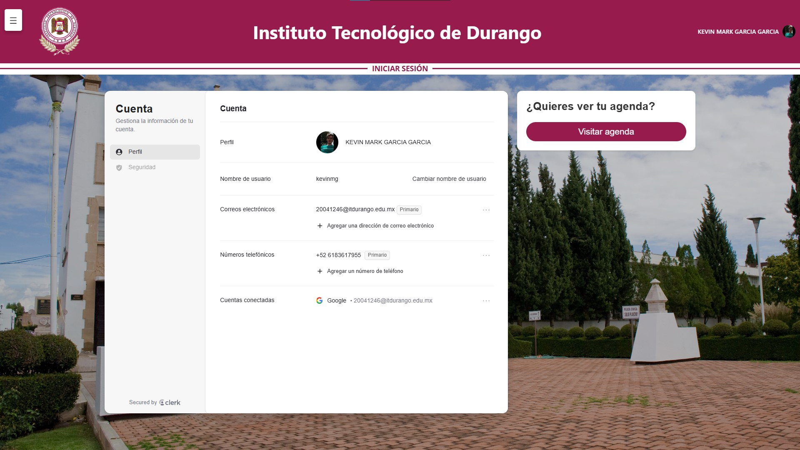

- **Calendar Integration**:
  - **Calendly API** for virtual agendas.
  - **FullCalendar** for displaying schedules on the platform.
  - **Google Calendar API** for real-time synchronization.

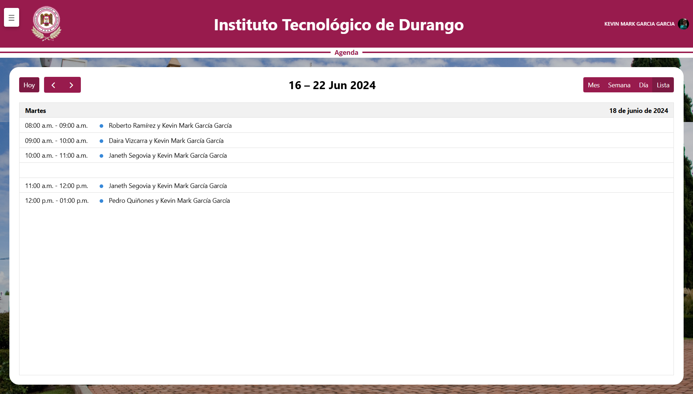

- **Interactive Email Invitations**:
  - Automatically sends emails to participants with rescheduling and cancellation links.

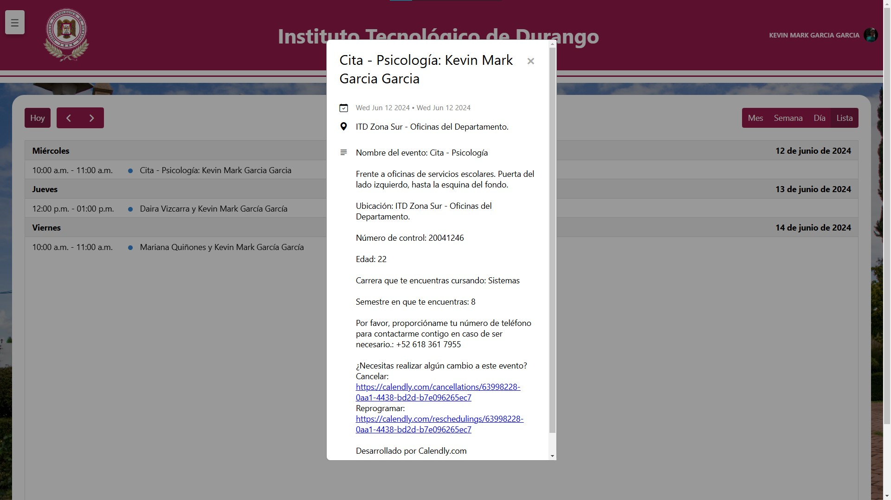

- **Responsive Design**:
  - Fully optimized for all devices: phones, tablets, and desktops.

    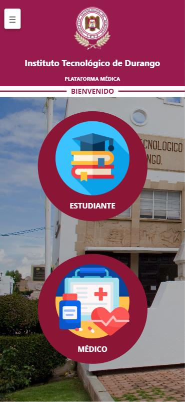
    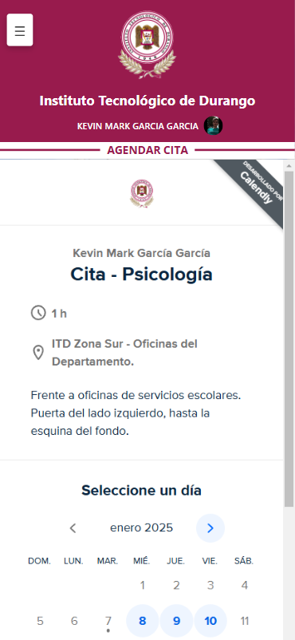
    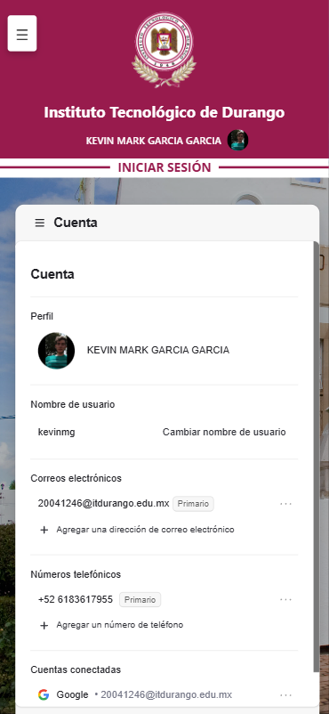

    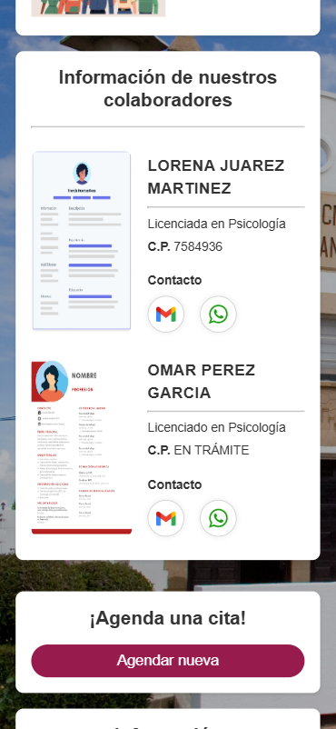
    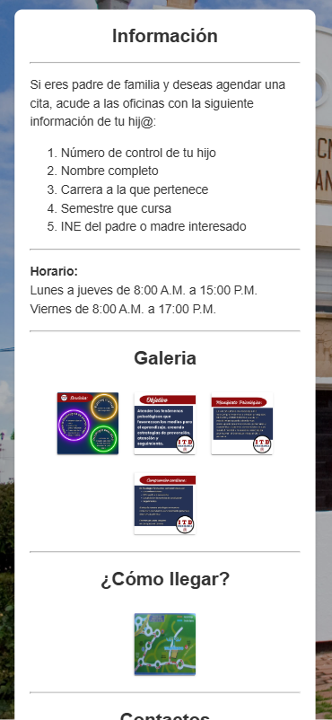

---

## 🛠️ Technologies Used
- **React**: Frontend framework.
- **Firebase**: Backend services, including database and hosting.
- **Clerk API**: User authentication and management.
- **Calendly API**: Virtual scheduling management.
- **Google Calendar API**: Calendar synchronization.
- **Lightbox for React**: Interactive multimedia content display.
- **FullCalendar**: Advanced calendar integration.
